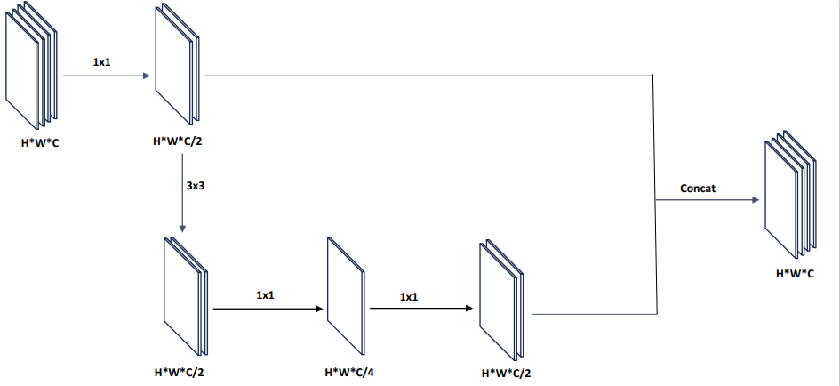

This document is "PDNet by PDConv : Better lightweight detector" code. The environment is configured in the readme document in the project, and the code is mainly changed in PDNet.py, which can be run by running train.py. The dataset is an open source dataset, which can be downloaded by yourself, and the download address is also shown in the paper.
# PDNet by PDConv : Better lightweight detector
This codebase serves as the open-source implementation for our research paper titled 'PDNet by PDConv : Better lightweight detector.' Feel free to explore and utilize the code for your reference and research purposes.

## Abstract
Model lightweighting has a non-negligible importance in edge computing and mobile devices. Current research in the area of fast network design generally focuses on model computation compression and speedup. Many models attempt to achieve model compression by dealing with redundant feature maps, however, most of these methods choose to preserve the feature maps with simple manipulations and do not achieve effective redundant feature map reduction. In this paper, we propose a new convolutional module, PDConv, whose core reduces the complexity of the network by compressing the redundant feature maps and ensures the loss of accuracy by increasing the network width. Compared with traditional methods, PDConv performs well in handling redundant feature maps, especially in deep networks. Its FLOPs are comparable to deep separable convolution, yet with higher accuracy. We further propose PDBottleNeck as well as PDC2f, and finally build the lightweight network PDNet for experimental validation based on the PASCAL VOC dataset. Compared to Swin Transformer, our method achieves more than 22% in FLOPs and improves 2.5\% in mAP50:95 accuracy. On the CoCo2017 dataset, our large PDNet achieves a 1.1% improvement in mAP75 and lower FLOPs compared to the latest RepVit.



## datasets
Train and validate the model on the trainval split of VOC2007 and VOC2012 datasets. Evaluate the model on the test split of VOC2007.  
The PASCAL VOC2007 dataset is available at http://host.robots.ox.ac.uk/pascal/VOC/voc2007/  
The PASCAL VOC2012 dataset is available at http://host.robots.ox.ac.uk/pascal/VOC/voc2012/  
The CoCo2017 dataset is available at https://cocodataset.org/
## install&Usage
"Enter the project and run the code."
```bash
pip install -r requirements.txt
python main.py
